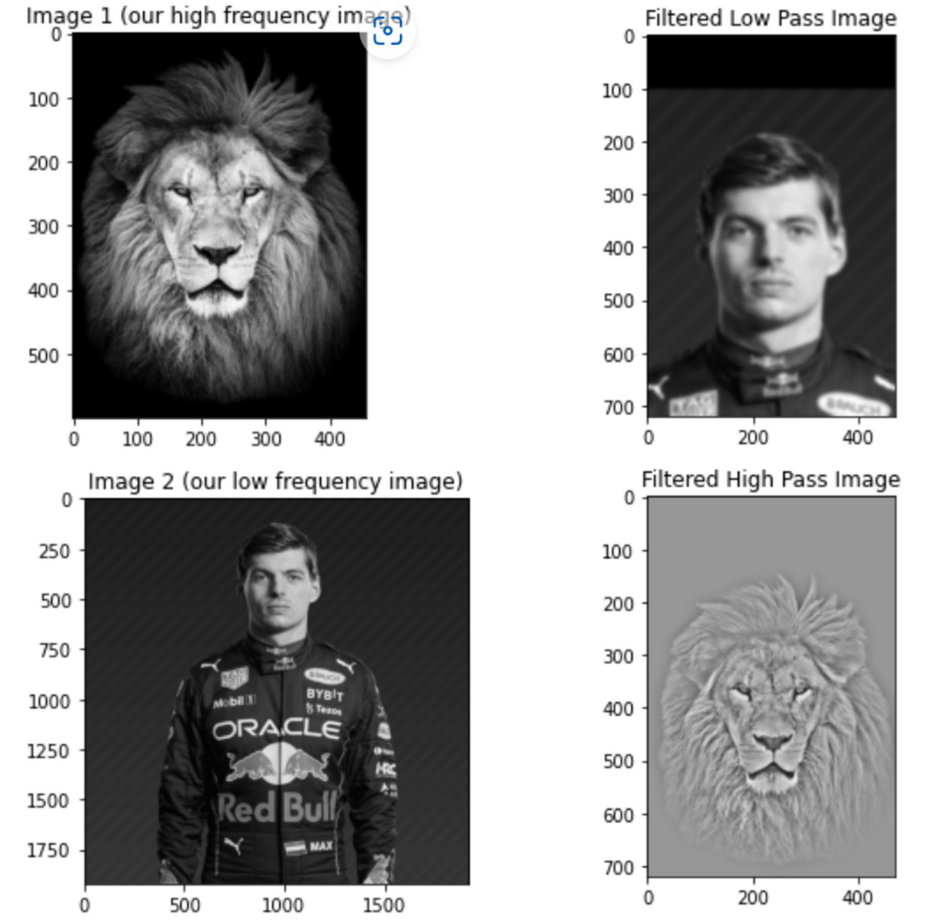
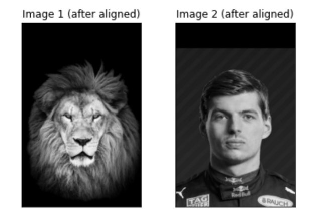
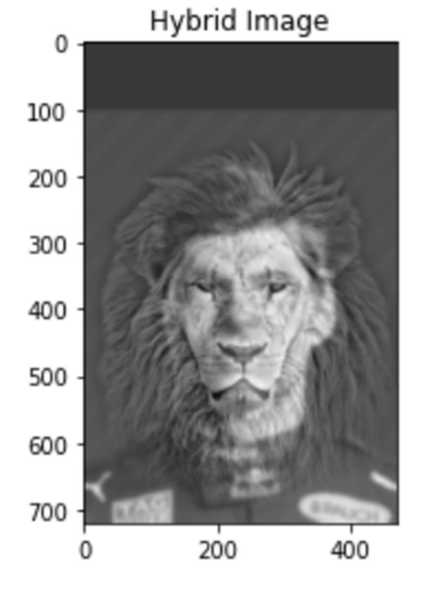
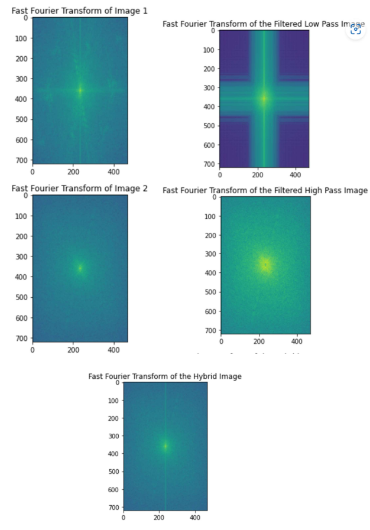
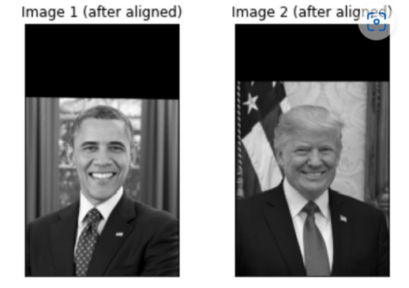
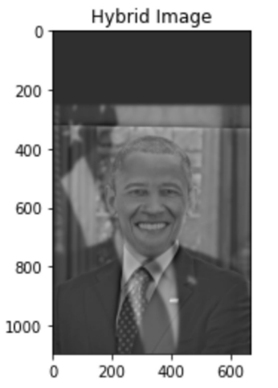
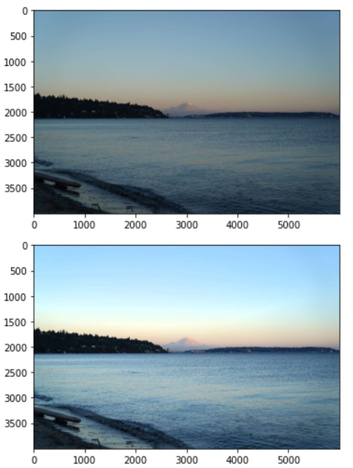
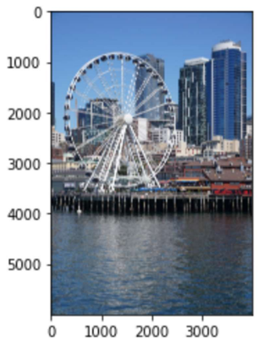
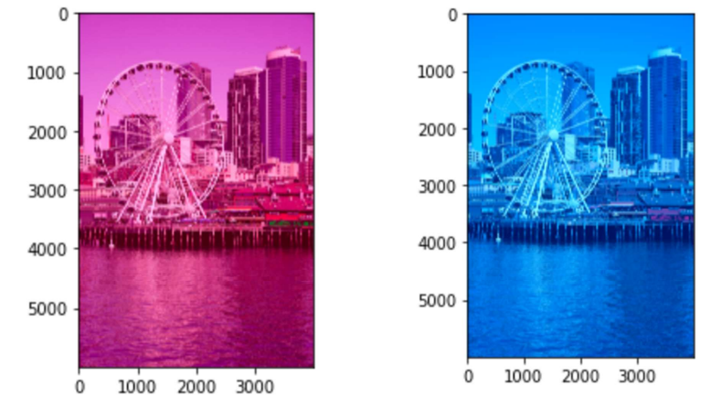

# Hybrid Images
Author: Jiayin Meng

## Hybrid Images Main Result
### Original and Filtered Input Images

### Hybrid Image Result

### FFT images of each original and filtered image and the hybrid image

### Additional Hybrid Image Result

## Image Enhancement Tasks

### Color Enhancement

### Color Shift

